

# Desafío 01 | Alestra

- [1. Acerca de Alestra](#1-acerca-de-alestra)
- [2. Reto de Negócio](#2-reto-de-negocio)
- [3. Objetivo](#3-objetivo)
- [4. Desarrollando la Solución](#4-desarrollando-la-solución)
  - [4.1. Pre-requisitos](#41-pre-requisitos)
  - [4.2. Resumen de tareas](#42-resumen-de-las-tareas)
  - [4.3. Desarrollo](#43-desarrollo)
- [5. Envío](#5-envío)
- [6. Sobre la evaluación](#6-sobre-la-evaluación)

## Para Ayudarte

- [Material de apoyo](#material-de-apoyo)
- [Solución de problemas](#solución-de-problemas)
- [Licencia](#license)

## 1. Acerca de Alestra

Alestra es el único proveedor de Innovación Digital con más de 20 años como líder en transformación digital y más de 10 años de experiencia en soluciones de innovación corporativa. A través de su portafolio habilita a las organizaciones con soluciones de redes administradas, colaboración, ciberseguridad, nube e integración de sistemas, en alianza con fabricantes tecnológicos líderes en el mundo.

    <a href="https://www.youtube.com/watch?v=TMBUmSwOwaw">
       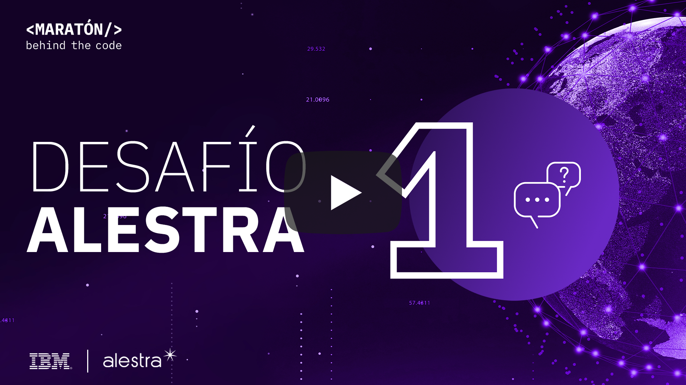
    </a>

## 2. Reto de Negocio

Durante el trabajo es común que en algún momento tengamos un problema técnico en nuestros dispositivos, por ejemplo, la batería que no carga, la licencia de la VPN caducó o el correo electrónico que no abre. En estas situaciones la solución es buscar el área de soporte de la empresa.

El área de soporte funciona con una cola, donde la prioridad del servicio se asigna por orden de llegada y la cola se mueve según la disponibilidad del empleado de soporte. En tiempos de pandemia y aislamiento social, es evidente que este modelo de servicio no es el adecuado para el trabajo a distancia.

Con esto en mente, Alestra, una empresa mexicana de TI, que siempre busca brindar las mejores soluciones a sus clientes, usará a Watson para ofrecer soporte cognitivo. De esta forma será posible paralelizar el servicio, con el fin de atender a muchos empleados a la vez priorizando los casos más críticos.

## 3. Objetivo

La idea del desafío es ayudar a los empleados del área de soporte de una empresa a realizar un servicio más rápido y objetivo, para que quienes necesitan soporte hablen primero con un Asistente Virtual y así identificar la demanda generando al final un ticket que deberá ser resuelto por soporte.

Este desafío debe resolverse con Watson Assistant y tu tarea será implementar el Asistente Virtual con inteligencia artificial para identificar las demandas del usuario para la generación de tickets.

## 4. Desarrollando la Solución

### 4.1. Pre-requisitos
Para poder realizar este desafío, se deben cumplir con los siguientes requisitos previos:

- Regístrate en la [Maratón Behind the Code](https://ibm.biz/maratona) y confirma el correo electrónico de registro.
- Regístrate con [IBM Cloud](https://ibm.biz/registro-maratona) y confirma el correo electrónico de registro.

### 4.2. Resumen de las tareas

1. Instanciar Watson Assistant en IBM Cloud.
2. Importar el Skill proporcionado en este repositorio (``skill-Alestra-Oficial.json``) en Watson Assistant.
3. Desarrollar la conversación según el desafio.
4. Desplegar la aplicación en IBM Cloud (Usando el toolchain proporcionado).
5. Acceder a aplicación probar y envíar tu solución.

### 4.3. Desarrollo

Watson Assistant es la herramienta creada por IBM para crear asistentes virtuales. A través de ejemplos de formas en que el usuario se comunica y utilizando inteligencia artificial, es capaz de identificar lo que se está escribiendo. Watson no es una herramienta que lo sepa todo, funciona dentro de cierto ámbito. Por lo tanto, al interactuar con él sobre otro tema, no estará seguro de responder correctamente.

Watson Assistant funciona sobre la base de `intents`. Identifican lo que el usuario quiere hacer y podemos asociarlos con verbos, por ejemplo: 'Quiero un café' y 'Un jugo de naranja por favor' son ejemplos de cómo pedir una bebida y podemos definir la `intent` de ordenar bebidas. Es importante dejar en claro que la inteligencia artificial se aplica a las `intents` y que al insertar ejemplos sobre una determinada `intent`, Watson creará un modelo de lenguaje natural capaz de identificar lo que el usuario está buscando.

Es común que una `intent` sea genérica hasta el punto de que Watson solo identifique la acción del usuario. 'Quiero un café' y 'Un jugo de naranja por favor' indican a Watson que el usuario quiere una bebida, pero no especifica cuál. Para llevar a cabo esta diferenciación de objetos existen `entities` que funcionan como una clase que agrega sus objetos. Para los ejemplos citados es posible distinguir la `entity` 'Bebida' cuyos objetos son 'café' y 'jugo de naranja'. De esta forma Watson podrá identificar la acción del usuario y a qué objeto se refiere.

Con las `intents` y las `entities` creadas, es posible establecer un diálogo. El diálogo sigue la estructura computacional del árbol y se accede a sus nodos a través de las condiciones establecidas por el desarrollador, y estas condiciones son `intents` y `entities`. En otras palabras, el diálogo no es más que la respuesta proporcionada por Watson al identificar la condición de un nodo.

En este repositorio, en el directorio [dataset](./dataset) hay una 'Skill' que debe usarse como punto de partida para desarrollar la solución. Ella ya tiene todas las `intents` y `entities` necesarias para resolver el desafío.

* Intents
    * Saludo
    * Adios
    * Problem_report
    * Request

* Entites
    * application
    * problem
    * request
    * Afirmacion

Aunque las `intents` y las `entities` ya están completadas, el diálogo no está completo. Solo tiene el nodo inicial, otros casos y Problem_report implementados, faltando el nodo Saludo, Adios y Request. Su tarea es implementar los tres nodos que faltan para que sea posible mantener un flujo de diálogo consistente, donde a partir de la identificación de la demanda del usuario se brinde la respuesta adecuada.

Al identificar la `intent` de Saludo, su asistente debe responder con un saludo.

Al identificar la `intent` de Adios, su asistente debe terminar la conversación con una despedida.

Al identificar la Solicitud de `intent`, su asistente debe identificar la solicitud (`Request intent`), el tipo de solicitud (`request entity`) y la aplicación correspondiente (`application entity`) . El asistente debe responder informando el tipo de solicitud y aplicación, junto con un número de ticket generado para esta solicitud. Adicionalmente el asistente debe preguntar si el usuario quiere acceso al reporte de la solicitud en el futuro (Si o No). Para este nodo es recomendable utilizar el nodo Problem_report como ejemplo.

> Aclaración: El número de reporte siempre lo debe responder junto con el tipo de solicitud y aplicación. Y preguntar si desea acceso a un reporte.. el reporte no es lo mismo al numero del incidente. despues de la pregunta deben esperar el "si" o "no" y responder en casi que sea un “Si” con un acceso concedido al reporte o algo por el estilo que diga que tiene acceso al reporte

Las `intents` ya están completadas, pero eso no significa que no puedas agregar o eliminar ejemplos, ya que estas modificaciones pueden mejorar la confianza en la identificación del modelo. No dudes en realizar los cambios que consideres necesarios siempre que el resultado sea el especificado anteriormente.

En el video a continuación, se explica en detalle todo el proceso de desarrollo de la solución. Si eres un principiante en el mundo de Watson Assistant, te recomendamos que veas el video para responder cualquier pregunta sobre este desafío.

    <a href="https://youtu.be/fUXp2BoklQE">
       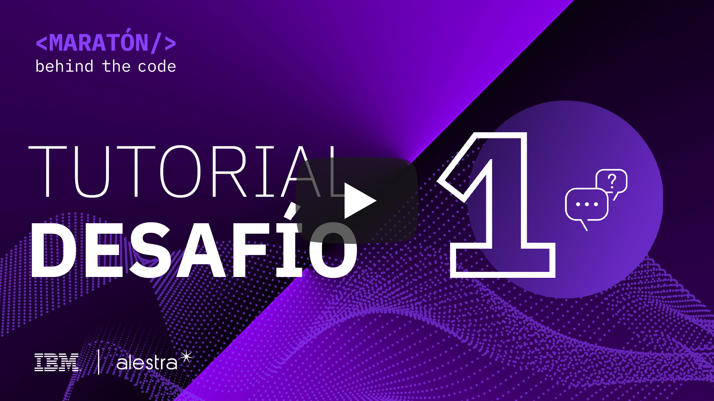
    </a>

🚨 **GUARDA LAS CREDENCIALES. LAS NECESITARAS PARA SUBIR LA APLICACIÓN** 🚨

Para obtener la `IAM_APIKEY` (o en algunos casos, solo la` API Key`) y la `URL` de Watson Assistant, ve a https://cloud.ibm.com/resources y consulta en la lista de` Service` , encontrarás todos los servicios prestados en tu cuenta. Accede a tu servicio de Watson Asistant.

    <h2><b>Watson Assistant</b></h2>
    <h3><b>IAM_APIKEY de Watson Assistant</b></h3>
    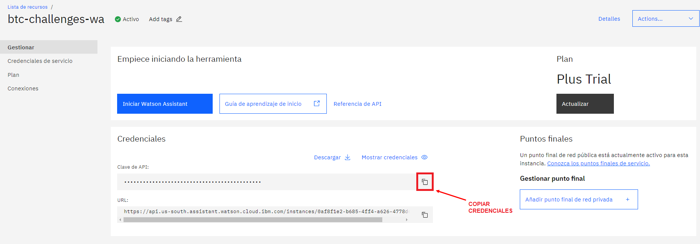
    <h3><b>URL de Watson Assistant</b></h3>
    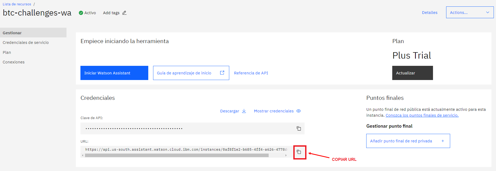

Además de esta credencial, se requieren skillId y AssistantId.

La sección de skill incluye el skillId

    <h2><b>SkillId Watson Assistant</b></h2>
    <h3><b>Clic en los tres puntos</b></h3>
    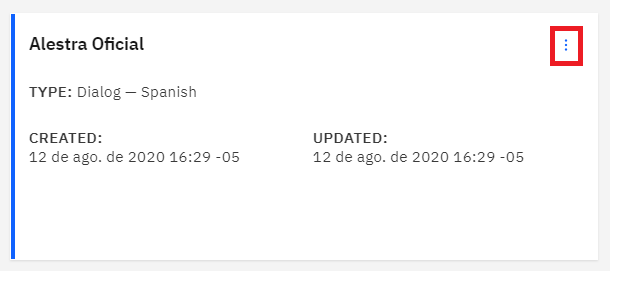
    <h3><b>Clic en View API Details</b></h3>
    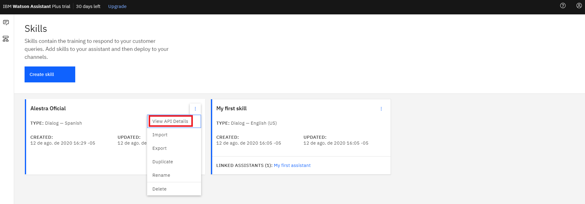
    <h3><b>SkillId</b></h3>
    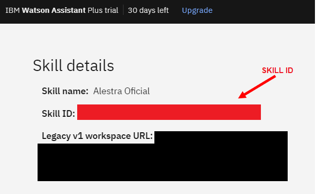

En la sección Asistente creará un asistente.

    <h2><b>Assistant</b></h2>
    <h3><b>Crea un assistant</b></h3>
    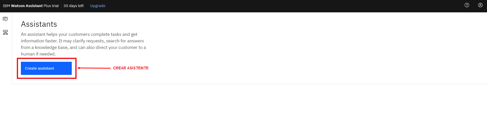
    <h3><b>Da un nombre y crea un assistant</b></h3>
    
    <h3><b>Adiciona una skill</b></h3>
    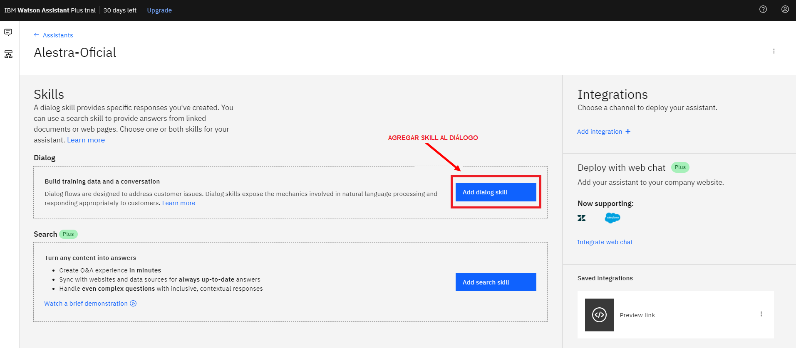
    <h3><b>Seleciona tu skill</b></h3>
    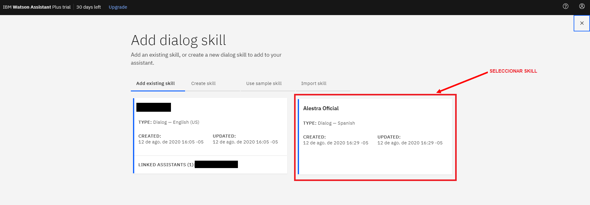
    <h3><b>Clic en tres puntos</b></h3>
    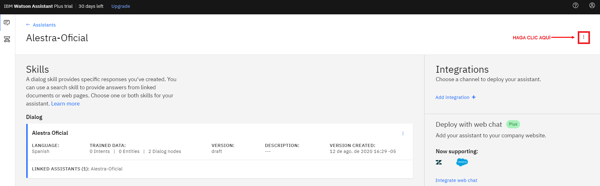
    <h3><b>Clic en Settings</b></h3>
    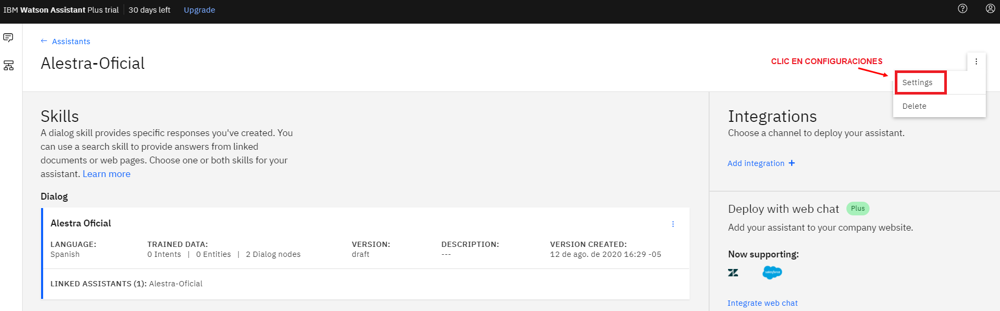
    <h3><b>Clic en API Details</b></h3>
    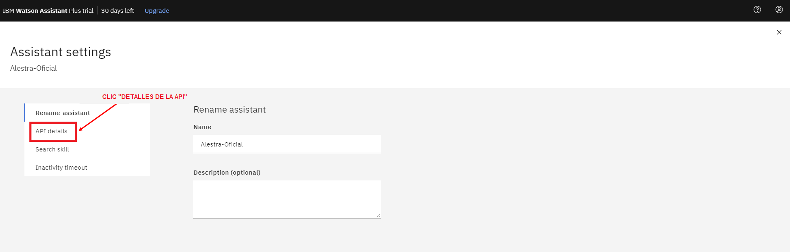
    <h3><b>Copy AssistantId</b></h3>
    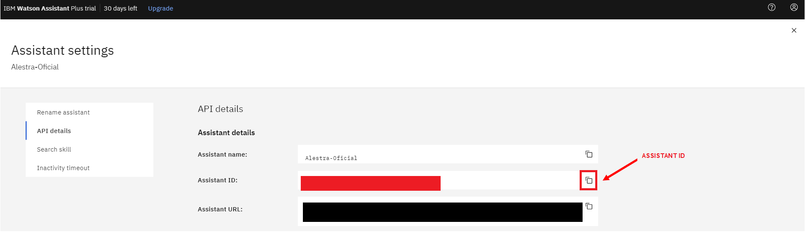

## 5. Envío

Para cargar la aplicación en IBM Cloud, debes **hacer clic en el botón a continuación**, que activará la herramienta IBM Cloud _Continuous Delivery_ (también conocida como _Delivery Pipeline_). La herramienta te pedirá tus credenciales, tu correo electrónico(registro de la Maratón) y una contraseña, que debes elegir y utilizar en el futuro (La llamaremos contraseña del toolchain).

> Aclaración: El nombre del toolchain no puede contener espacios ni caracteres especiales ( - es valido).

<b>🚨 HAZ CLIC PARA ENVIAR LA APLICACIÓN A IBM CLOUD 🚨</b>

    <h2><b>Despliegue de la aplicación</b></h2>
    <h3><b>Toolchain</b></h3>
    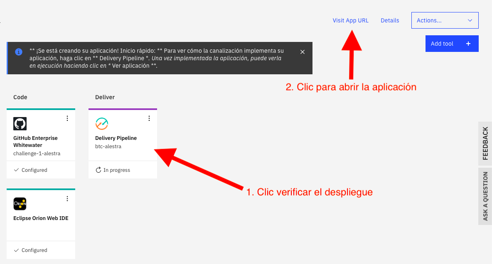
    <h3><b>Valida que la aplicacón se haya desplegado</b></h3>
    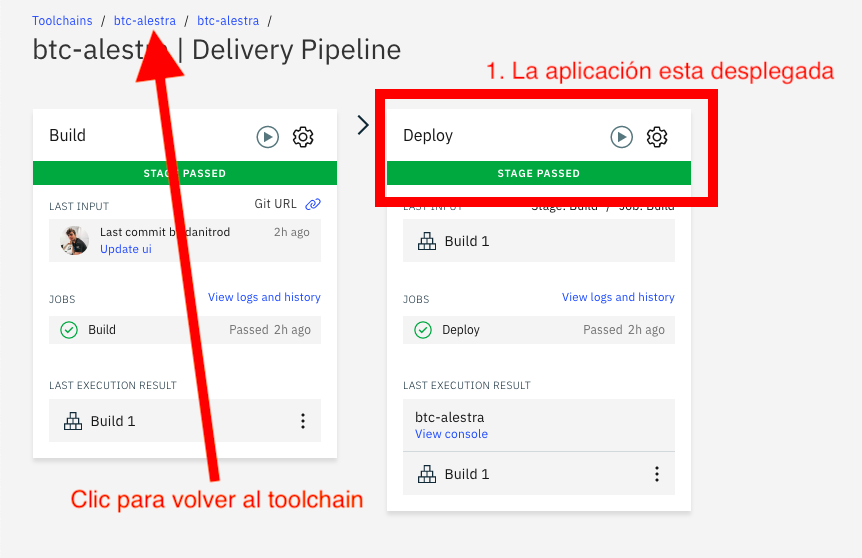
    <h3><b>Abre la aplicación y prueba tu asistente</b></h3>
    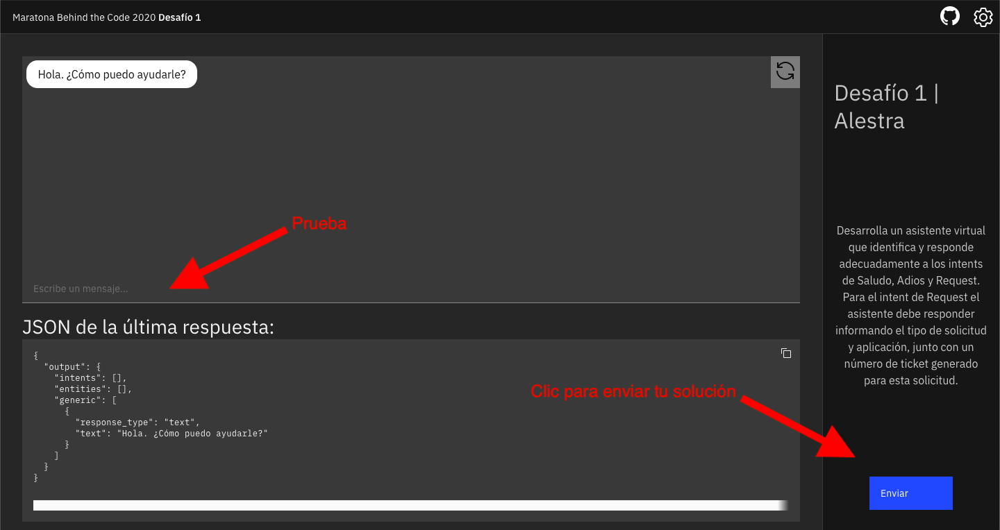
    <h3><b>Envia tu solucón</b></h3>
    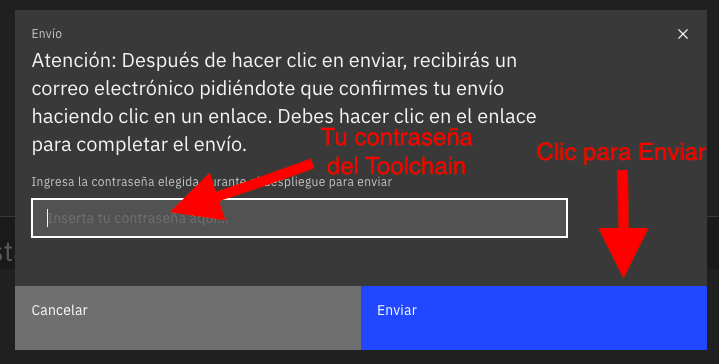

🚨 **PON A PRUEBA TU MODELO DE ENTRENAMIENTO** 🚨

Prueba mucho tu asistente, asegúrate de que esté respondiendo a todas las condiciones y con el flujo adecuado. También asegúrate que tu asistente esté indicando la intención correcta para las entradas más diversas y si su confianza en ellas es razonable.

## 6. Sobre la evaluación

El sistema probará si el asistente virtual identifica y responde adecuadamente a los `intents` de Saludo, Adios y Request. Tu puntuación será una función que calcula si la respuesta obtenida contiene los elementos especificados anteriormente y la confianza que el asistente tiene en ella.

El tiempo de entrega no se incluye en el cálculo de la puntuación del desafío. Sin embargo, para todos los participantes que presenten este desafío en la primera semana después del lanzamiento, recibirán una bonificación del 10% de la puntuación final.

## Material de Apoyo
- [Una guía del portal de IBM Developer para principiantes en Watson Assistant](https://developer.ibm.com/es/patterns/assemble-a-pizza-ordering-chatbot-dialog/)

## Solución de problemas

Mira el [video explicativo](#43-desarrollo) provisto en la Sección 4, o si lo deseas, revisa la documentación de los servicios involucrados en este desafío:

- [Video Dudas Retos de la Maratón](https://www.youtube.com/watch?v=9HsfPf6QrLc)
- [Video solución dudas comunes desafío 1 y 2](https://www.youtube.com/watch?v=vmiQ54bK65I)
- [Video ¿Como mejorar el puntaje en los desafios 1 y 2?](https://www.youtube.com/watch?v=1VbxxVkd-xI)
- [IBM Watson Assistant](https://cloud.ibm.com/docs/assistant?topic=assistant-getting-started)

Accede al discord oficial de la Maratón 2020 para hacer preguntas y/o interactuar con otros participantes: [Discord](https://discord.gg/Q9At74C).

## License

Copyright 2020 Maratón Behind the Code

   Licensed under the Apache License, Version 2.0 (the "License");
   you may not use this file except in compliance with the License.
   You may obtain a copy of the License at

       http://www.apache.org/licenses/LICENSE-2.0

   Unless required by applicable law or agreed to in writing, software
   distributed under the License is distributed on an "AS IS" BASIS,
   WITHOUT WARRANTIES OR CONDITIONS OF ANY KIND, either express or implied.
   See the License for the specific language governing permissions and
   limitations under the License.

## Fork by Angel Vivanco 06/dic/2022